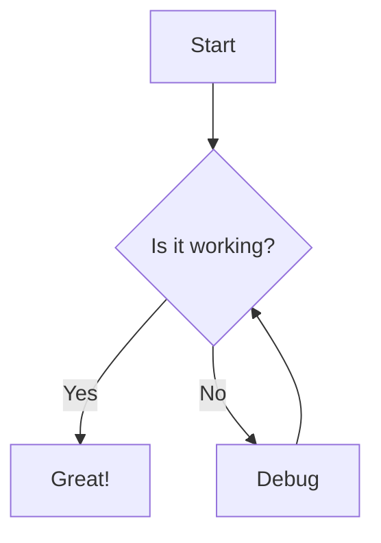

# Hello
<pre className="mermaid">

graph TB

    subgraph Apache
        direction LR
        domain[Domain & Publish Port]
    end


    subgraph Source Code
        subgraph Editor
            myapp[myapp git repo]
            roadmap[roadmap git repo]
        end

        subgraph Publish
            git_clone[git clone best myapp]
        end

        subgraph Backup
            backup_myapp[backup myapp repo]
            backup_roadmap[backup roadmap repo]
        end
    end

    subgraph Database
        postgres[Postgres :5432]
    end

    subgraph Podman
        subgraph Images
            pub_image[publish source image]
            pg_image[postgres image]
        end

        subgraph Pod
            subgraph mypod
                pg_container[postgres container<br>internal:5432<br>external:5431]
                pub_container[publish container]
            end
        end

        subgraph Volume
            pod_storage[mypod storage]
        end
    end

    myapp -->|clone| git_clone
    Database -->  pg_image
    Publish --> pub_image


</pre>



```
graph TD
    A[Start] --> B{Is it working?}
    B -->|Yes| C[Great!]
    B -->|No| D[Debug]
    D --> B
```
